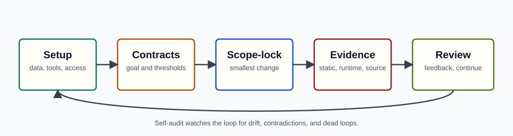

# Harnessloop


Harnessloop is a project-local protocol and plugin for long-running AI agent work. It keeps goals, evidence, handoffs, validation, session takeover, and self-audit in files so a task can continue across agents without losing context or accepting unsupported claims.

Use it when the task is too important or too long to trust chat memory alone.

## Why

Long agent sessions fail in predictable ways:

- Context gets compressed or lost.
- Work continues without fresh evidence.
- One session cannot safely hand off to another.
- Runtime validation drifts from the goal.
- External tools, accounts, and data sources are implicit.
- Reviews become generic engineering opinions instead of evidence-backed gates.

Harnessloop turns that work into an explicit loop:



## When To Use

Use Harnessloop for:

- Long coding, research, data, or validation tasks.
- Work that depends on real static data, generated data, runtime evidence, source code, or external systems.
- Cross-session task takeover from another agent.
- Tasks that need minimal-change scope locks and auditable handoffs.
- Work where failure, rollback, or human confirmation must be explicit.

Do not use it for:

- One-off questions.
- Small edits that can be verified immediately.
- Tasks where no durable evidence or handoff is needed.

## Install

Codex on Windows:

```powershell
.\scripts\install-codex.ps1
```

Claude Code on Windows:

```powershell
.\scripts\install-claude.ps1
```

Codex on macOS/Linux:

```bash
./scripts/install-codex.sh
```

Claude Code on macOS/Linux:

```bash
./scripts/install-claude.sh
```

Equivalent CLI commands:

```powershell
codex plugin marketplace add .
codex plugin add harnessloop@harnessloop

claude plugin marketplace add . --scope user
claude plugin install harnessloop@harnessloop --scope user
```

## Start Your First Loop

Harnessloop is currently a skill/protocol, not a standalone shell CLI. Commands such as `harnessloop status` and `harnessloop continue` describe protocol modes that an agent should execute through `$harness-loop`.

After installing, ask the agent:

```text
Use $harness-loop to set up Harnessloop for this project and start a goal-driven loop.
```

For deterministic initialization from this repository:

```powershell
.\scripts\init-project.ps1 -Project C:\path\to\target-project
```

macOS/Linux:

```bash
./scripts/init-project.sh --project /path/to/target-project
```

The first setup creates or fills:

```text
.harnessloop/
  setup/
    data-sources.md
    cost-context-policy.md
  state/
    current.md
    environment.md
    control-contract.md
    evidence-index.md
    self-check.md
  meta/
    self-audit.md
    evolution-issues/
  goals/
```

Then define a goal, create decomposable thresholds, lock the first round scope, write evidence, run adversarial review, classify feedback, and continue only through the control gate.

## Take Over An Existing Agent Session

The source session does not need Harnessloop installed. Ask it to generate a `Harnessloop Transfer Packet`, then save the result:

```powershell
.\scripts\init-project.ps1 -Project C:\path\to\target-project -Intake task-slug
```

```text
.harnessloop/intake/YYYYMMDD-HHMM-<task-slug>/transfer-packet.md
```

Harnessloop runs an intake gate before creating a formal goal:


If the packet is incomplete, Harnessloop writes `gap-review.md` and asks only for missing facts. If it passes, the first round should normally be `intake-review`, which maps imported evidence into `.harnessloop/state/evidence-index.md` before any business execution continues.

The transfer packet must include task identity, goal contract, progress state, change state, documentation inventory, process artifacts, evidence, external tools, credential requirements without secret values, decisions, risks, and next handoff recommendation. See [docs/usage.md](docs/usage.md) for the full prompt.

## Evidence Model

Harnessloop separates evidence artifact health from whether that evidence supports acceptance. A failed runtime test can be a valid evidence artifact and still produce negative feedback.


Evidence classes:

- `static`: real datasets, docs, reports, source-of-truth records.
- `dynamic`: generated data, sampled outputs, model/tool outputs.
- `runtime`: tests, CI, remote automation, probes, canaries, monitoring.
- `source`: repository source, schema files, source-data files.

## Key Concepts

- `goal`: what the loop is trying to achieve.
- `transfer packet`: a structured handoff from an existing agent session.
- `intake gate`: the takeover review that blocks unsafe continuation.
- `scope-lock`: the exact boundary of what one round may change.
- `evidence gate`: proof required before a round can pass.
- `handoff`: a file-based task transfer for subagents or reviewers.
- `self-audit`: loop health check for dead loops, contradictions, drift, and runaway context.
- `evolution issue`: a redacted issue that helps improve Harnessloop itself.

## Skills

- `$harness-loop`: run or take over a goal-driven Harnessloop in an installed project.
- `$harness-loop-issue`: analyze a Harnessloop evolution issue and propose the smallest upstream improvement.

## Repository Map

- `docs/usage.md`: product-level usage guide and transfer packet prompt.
- `docs/harnessloop-framework.md`: framework design and detailed protocol.
- `docs/harnessloop-flow.mmd`: canonical detailed Mermaid flow source.
- `docs/harnessloop-flow.svg`: rendered detailed flow preview.
- `docs/assets/`: README and documentation visuals.
- `plugins/harnessloop/`: plugin source.
- `plugins/harnessloop/skills/`: installable skills and templates.
- `examples/mock-project/`: artificial reference project showing setup, intake, evidence, review, decision, self-audit, and evolution issue files.

## Validate

```powershell
.\scripts\validate.ps1
```

The validation script checks marketplace manifests and runs Claude Code strict validation against the marketplace root and plugin root.

Validate skills directly:

```powershell
python C:\Users\litianyi\.codex\skills\.system\skill-creator\scripts\quick_validate.py plugins\harnessloop\skills\harness-loop
python C:\Users\litianyi\.codex\skills\.system\skill-creator\scripts\quick_validate.py plugins\harnessloop\skills\harness-loop-issue
```

## Current Limits

- Harnessloop defines a protocol and skills; it does not yet provide a full shell CLI.
- It does not ship fixed data connectors. Projects must declare their own tools, accounts, data sources, and validation systems.
- The detailed flow should be maintained from `docs/harnessloop-flow.mmd`; generated or decorative imagery must not replace evidence-bearing flow diagrams.

Keep the plugin name as `harnessloop` in both manifests so marketplace selectors stay stable:

```text
harnessloop@harnessloop
```
