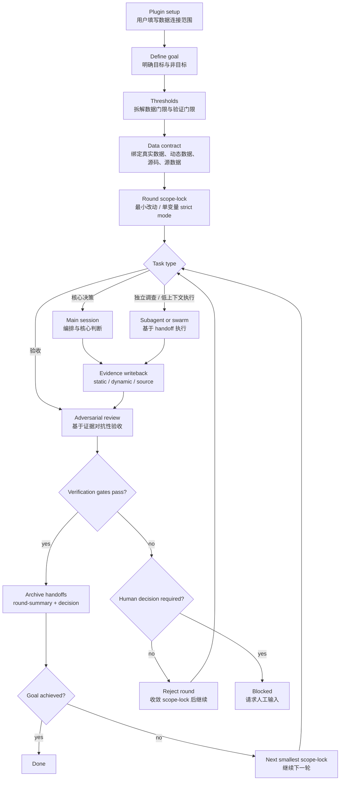

# Harnessloop Framework Draft

This document captures the first minimal design for the Harnessloop plugin and skill.

Harnessloop is a project-local protocol for running goal-driven harness loops around real static data, dynamic generated data, source code, and source-data files. It is not a broad automation platform yet. The first version should make the workflow visible, enforceable, and file-system based.

## Design Boundary

In scope for the first version:

- A minimal installable skill named `harness-loop`.
- A project-local `.harnessloop/` file protocol.
- Goal, threshold, data-contract, round, handoff, evidence, review, and archive conventions.
- Role and model-selection rules for main session versus subagent/swarm work.
- A visual flow diagram.

Out of scope for the first version:

- Concrete data connector implementations.
- Fixed data-source schemas.
- Automatic orchestration scripts.
- Deep Codex or Claude Code marketplace behavior beyond the existing plugin scaffold.

## Core Principles

1. Every loop has a clear goal.
2. Data must not become stale or drift silently.
3. Thresholds must be decomposable and verifiable.
4. Every round has a strict adjustment boundary.
5. The default adjustment is minimal change.
6. Autoresearch or drift-prone work should use one-variable strict mode.
7. Handoffs happen through files with traceable names.
8. Closed handoffs are archived promptly.
9. Main sessions orchestrate and decide; subagents or swarms handle isolated work and adversarial review.
10. Verification must cite real evidence, not generic engineering judgment.
11. The loop should continue toward the goal unless a human decision is required.

## Project File Protocol

```text
.harnessloop/
  setup/
    data-sources.md
    model-rules.md
  goals/
    YYYYMMDD-NNN-<goal-slug>/
      goal.md
      thresholds.md
      data-contract.md
      rounds/
        0001/
          scope-lock.md
          handoffs/
          evidence/
            static/
            dynamic/
            source/
          reviews/
          round-summary.md
          decision.md
          archive/
```

## Setup Files

`setup/data-sources.md` is intentionally open-ended for now. During plugin setup, the user fills in the data-source range and content. The framework should not assume a specific data domain.

It should record:

- Real static data sources.
- Dynamic/generated data sources.
- Refresh expectations.
- Drift risks.
- Validation method for each source.

`setup/model-rules.md` records the local interpretation of role and model policy:

- Main session: orchestration and core decisions.
- Subagent/swarm: independent investigation, low-context execution, adversarial review.
- Codex preference: subagent with `gpt-5.5-medium` where available.
- Claude Code preference: swarm/subagent with Sonnet and high or extra-high reasoning where available.
- Non-delegable decisions: goal interpretation, scope-lock changes, required human product/business decisions, acceptance after failed review.

## Goal Files

`goal.md` states:

- Goal.
- Non-goals.
- Success condition.
- Required human decisions.

`thresholds.md` splits requirements into:

- Data thresholds: freshness, completeness, representativeness, drift controls.
- Verification thresholds: checks required before accepting a round.

`data-contract.md` binds acceptable evidence:

- Real static data.
- Dynamic/generated data.
- Repository source.
- Source-data files.

## Round Files

Each round has one `scope-lock.md`.

It must define:

- Round objective.
- Allowed files, data, or variables to change.
- Disallowed changes.
- Verification commands or checks.
- Rollback condition.

Each round also has:

- `handoffs/` for open delegated tasks.
- `evidence/static/` for real static data evidence.
- `evidence/dynamic/` for dynamic/generated data evidence.
- `evidence/source/` for source and source-data evidence.
- `reviews/` for adversarial review outputs.
- `round-summary.md` for the accepted summary of what happened.
- `decision.md` for accepted, rejected, or blocked.
- `archive/` for closed handoffs.

## Handoff Naming

```text
<round>-<seq>-<role>-<task-slug>-<status>.md
```

Examples:

```text
0001-01-research-static-data-open.md
0001-02-execute-one-variable-open.md
0001-03-review-adversarial-open.md
0001-03-review-adversarial-closed.md
```

Each handoff must include:

- Objective.
- Inputs and evidence paths.
- Scope boundaries.
- Required output paths.
- Verification condition.
- Closeout summary.

## Verification Rule

A round cannot pass because it "looks reasonable".

The review must test the work against:

- The active goal.
- The active scope-lock.
- Data thresholds.
- Verification thresholds.
- Real static data freshness.
- Dynamic/generated data behavior.
- Repository source and source-data evidence.

If the review cannot cite evidence paths, the round is not accepted.

## Flow Diagram

The standalone Mermaid source is in [`docs/harnessloop-flow.mmd`](./harnessloop-flow.mmd).
The directly viewable SVG is in [`docs/harnessloop-flow.svg`](./harnessloop-flow.svg).



## First Skill Draft

The installable skill draft is at:

```text
plugins/harnessloop/skills/harness-loop/SKILL.md
```

It intentionally contains only the core execution protocol. Data connector setup, automation scripts, and concrete source schemas should be added only after the setup questions are clearer.
