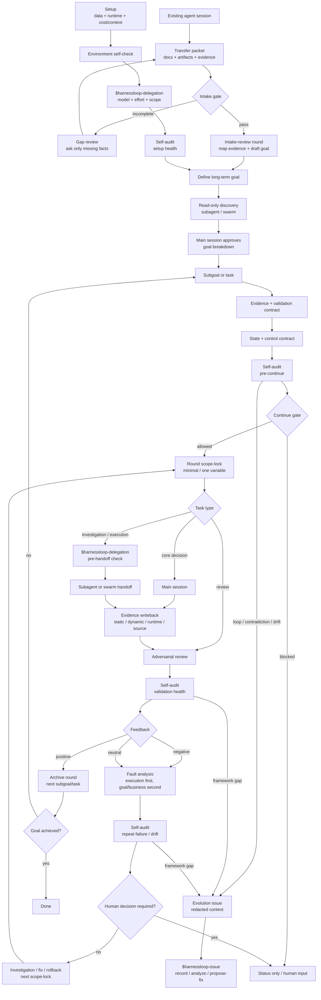

# Harnessloop Framework

This document describes the current Harnessloop plugin protocol and product model.

Harnessloop is a project-local protocol for running goal-driven harness loops around real static data, dynamic generated data, source code, source-data files, runtime validation, external systems, and agent handoffs. It is not a broad automation platform yet; its job is to make long-running agent work visible, enforceable, and file-system based.

## Design Boundary

In current scope:

- Installable skills named `harnessloop-init`, `harnessloop-intake`, `harnessloop-goal`, `harnessloop-evidence`, `harnessloop-channels`, `harnessloop-connectivity`, `harnessloop-secrets`, `harnessloop-delegation`, `harnessloop-status`, `harnessloop-continue`, `harnessloop-loop`, and `harnessloop-issue`.
- A project-local `.harnessloop/` file protocol.
- Existing-session takeover and intake-gate conventions.
- Long-term goal discovery and breakdown conventions.
- Goal, threshold, data-contract, feedback-policy, round, handoff, evidence, review, and archive conventions.
- Runtime validation evidence alongside static, dynamic, and source evidence.
- Cost/context rules for main session versus subagent/swarm work.
- A control plane for `status`, `continue`, evidence contract changes, and human intervention.
- Environment and model/effort self-checks before delegated work.
- A self-audit and evolution-issue path for detecting loop failure, contradiction, and drift in installed projects.
- An eval matrix for robustness across common project scenarios.
- A visual flow diagram.

Out of current scope:

- Concrete data connector implementations.
- Fixed data-source schemas.
- Automatic orchestration scripts.
- Deep Codex or Claude Code marketplace behavior beyond the existing plugin scaffold.

## Core Principles

1. Every loop has a clear goal.
2. Treat goals as long-term unless explicitly defined as single-round.
3. Imported work from another agent session must pass intake before business execution.
4. Use read-only delegated discovery before approving a goal breakdown.
5. Data must not become stale or drift silently.
6. Thresholds must be decomposable and verifiable.
7. Every round has a strict adjustment boundary.
8. The default adjustment is minimal change.
9. Autoresearch or drift-prone work should use one-variable strict mode.
10. Handoffs happen through files with traceable names.
11. Closed handoffs are archived promptly.
12. Main sessions orchestrate and decide; subagents or swarms handle isolated work and adversarial review.
13. Verification must cite real evidence, runtime evidence, or source evidence, not generic engineering judgment.
14. Feedback is positive, negative, or neutral; neutral feedback follows the negative path until resolved.
15. Status reads must be safe and read-only.
16. Continuation must pass a control gate before execution.
17. Expected model/effort and observed model/effort must be recorded when delegation is used.
18. The loop should continue toward the goal unless a human decision is required.
19. The loop must audit itself for dead loops, self-contradiction, drift, stale evidence, and cost/context runaway.
20. Harnessloop defects should be captured as redacted evolution issues with enough context for upstream improvement.

## Project File Protocol

```text
.harnessloop/
  setup/
    data-sources.md
    cost-context-policy.md
  local/
    .gitignore
    channel-params.example.json
    channel-params.json  # local ignored file, never committed
  intake/
    YYYYMMDD-HHMM-<task-slug>/
      transfer-packet.md
      intake-gate.md
      gap-review.md
  state/
    current.md
    environment.md
    control-contract.md
    evidence-index.md
    self-check.md
  meta/
    self-audit.md
    evolution-issues/
  evals/
    matrix.md
  goals/
    YYYYMMDD-NNN-<goal-slug>/
      goal.md
      goal-breakdown.md
      thresholds.md
      data-contract.md
      feedback-policy.md
      rounds/
        0001/
          scope-lock.md
          handoffs/
          evidence/
            static/
            dynamic/
            runtime/
            source/
          reviews/
          round-summary.md
          decision.md
          archive/
```

## Setup Files

`setup/data-sources.md` is intentionally open-ended for now. During plugin setup, the user fills in the data-source range and content. The framework should not assume a specific data domain.

Use the bundled initializer to create `.harnessloop/` skeleton files before filling project-specific facts:

```bash
python <skill-dir>/scripts/init_project.py --project <target-project>
```

For takeover:

```bash
python <skill-dir>/scripts/init_project.py --project <target-project> --intake <task-slug>
```

The initializer creates missing protocol files and skips existing files unless `--force` is explicitly used. It must not invent data sources, accounts, credentials, goals, validation results, or evidence.

It should record:

- Real static data sources.
- Dynamic/generated data sources.
- Refresh expectations.
- Drift risks.
- Validation method for each source.

`setup/cost-context-policy.md` records the local interpretation of role, model, budget, and context policy:

- Main session: orchestration and core decisions.
- Subagent/swarm: independent investigation, low-context execution, adversarial review.
- Codex preference: subagent with `gpt-5.5-medium` where available.
- Claude Code preference: swarm/subagent with Sonnet and high or extra-high reasoning where available.
- Non-delegable decisions: goal interpretation, scope-lock changes, required human product/business decisions, acceptance after failed review.
- Handoff input and output limits.
- Context that should stay out of the main session.

## Existing Session Takeover

Harnessloop can take over a long-running task that started in another agent session. The source session does not need Harnessloop installed. It only needs to produce a `Harnessloop Transfer Packet`.

Save takeover packets under:

```text
.harnessloop/intake/YYYYMMDD-HHMM-<task-slug>/transfer-packet.md
```

The packet must include:

- Task identity, current agent environment, repository path, and branch.
- Goal contract: goal, non-goals, success condition, acceptance criteria, required human decisions, and ambiguities.
- Progress state: completed, in progress, not started, current smallest next step, and whether continuation is safe.
- Change state: modified/added/deleted files, diff summary, unverified changes, rollback risk.
- Documentation inventory: existing and generated documents with source-of-truth status, trust level, freshness, relevance, and sensitivity.
- Process artifact inventory: notes, scratch files, temporary reports, test outputs, CI links, runtime observations, failed attempts, and generated-but-unverified artifacts.
- Evidence state: commands run, results, data sources, external systems, evidence paths, and unsupported claims.
- External tool and access contract: MCP, plugins, skills, CLIs, Jenkins, GitHub/GitLab, cloud platforms, databases, internal platforms, broker APIs, permissions, failure handling.
- Credential requirements: secret names, storage locations, required scopes, verification commands, status, and human action requirement. Secret values must not be stored.
- Decision log, risks, blockers, next handoff recommendation, and human questions.

Run an intake gate before formal goal creation. The gate writes `intake-gate.md` and checks whether the packet is complete, evidence-backed, safe to continue, and free of secret values. If the packet is incomplete, write `gap-review.md` and request only the missing information.

The first accepted round after takeover should normally be `intake-review`. It maps imported evidence into `state/evidence-index.md`, confirms source-of-truth documents, and drafts the formal goal. Business execution remains blocked until intake review passes.

## Control Plane

Harnessloop supports these protocol semantics through explicit skills. Codex skill mentions use kebab-case skill names such as `$harnessloop-status`; colon phrases such as `harnessloop:status` are natural-language aliases only, and `$harnessloop:status` is not valid.

`$harnessloop-status` is read-only. It reports active goal, active round, current feedback, open handoffs, evidence health, control state, environment state, next proposed action, and blocking reason. It must not create files, continue execution, or mutate state.

`$harnessloop-continue` reads current state and runs a continuation gate. It may continue only through allowed next actions:

- Positive feedback may advance to the next subgoal or task.
- Negative or neutral feedback may advance only to investigation, minimal fix, rollback, or human-confirmed contract revision.
- Blocked feedback may not continue without a human unblock record.
- Evidence or control contract failure prevents execution and moves to contract repair or missing-evidence work.
- Self-audit failure prevents execution unless the next action is a local repair, an explicit human-confirmed contract revision, or an evolution issue write-up.
- Imported work from `.harnessloop/intake/` cannot continue business execution until `intake-gate.md` passes and an `intake-review` round is accepted.

`$harnessloop-evidence` manages acceptable evidence through the `harnessloop-evidence` skill:

- `add`: register evidence type, path, freshness, validation method, and applicable goal or round.
- `check`: verify evidence exists, is fresh enough, and can be cited.
- `revise`: change acceptance criteria; require human confirmation.
- `reject`: record invalid, stale, unsupported, too-sensitive, or inapplicable evidence.
- `diff`: summarize the contract change and continuation effect.

`$harnessloop-channels` lists declared external systems, tools, and channels without probing. `$harnessloop-connectivity` checks only declared connectivity methods and must ask the user when required tools, credentials, permissions, endpoints, parameters, or write-safety details are missing. Failed, blocked, skipped, or confirmation-needed self-checks must ask for the exact missing facts before the loop continues.

`$harnessloop-secrets` manages local-only channel parameters and secret references in `.harnessloop/local/channel-params.json`. Use it when an evidence contract or external channel needs reusable local parameters. If the channel id, parameter key, sensitivity, storage method, and purpose are explicit, create a local placeholder key before evidence collection or connectivity checks. The committed Harnessloop files may store parameter keys, provider references, required scopes, and status, but never values.

`$harnessloop-delegation` checks whether subagent, swarm, or other delegated work can be trusted for the requested task type. It records expected versus observed model/effort, mechanism status, scope control, output path control, and evidence citation behavior. A blocked, failed, or unknown required condition prevents high-risk delegation unless a human-confirmed policy allows conservative continuation.

`harnessloop contract control` defines continuation authority:

- Auto-continue states.
- Human-confirm states.
- Stop conditions.
- Delegation boundaries.
- Acceptance authority after failed review.

`$harnessloop-issue record` creates a Harnessloop evolution issue when self-audit, a user, or an external reviewer finds a framework-level question or failure. It writes to `.harnessloop/meta/evolution-issues/`. `$harnessloop-issue analyze` classifies an existing issue, and `$harnessloop-issue propose-fix` produces the smallest upstream patch proposal.

`harnessloop intake review` is a protocol action for reviewing a transfer packet. It writes `intake-gate.md`, writes `gap-review.md` when needed, maps accepted evidence into the state index, and blocks business execution until the packet is evidence-backed.

## State Files

State files are control-plane indexes. They summarize and route the loop, but do not replace source-of-truth documents under `goals/` and `rounds/`.

`state/current.md` is the status entry point:

- Active goal.
- Active round.
- Current feedback.
- Open handoffs.
- Last accepted round.
- Next proposed action.
- Human decision requirement.
- Blocking reason.
- State source paths.

`state/environment.md` records:

- Detected environment: `codex`, `claude-code`, `other`, or `unknown`.
- Delegation mechanism.
- Subagent or swarm availability.
- Expected and observed model.
- Expected and observed effort/reasoning.
- Verification method.
- Mismatch handling.

`state/control-contract.md` records human intervention and continuation rules.

`state/evidence-index.md` indexes evidence by ID, type, path, applicability, freshness requirement, observed timestamp, validation method, citation requirement, artifact health, claim support, acceptance effect, reproducibility, and sensitivity.

`local/channel-params.json` stores ignored local channel values or provider references. `local/channel-params.example.json` documents expected keys without values. No setup, evidence, state, handoff, review, or decision file may copy values out of the local store.

`state/self-check.md` records setup and continuation gate checks.

## Meta Control And Self Evolution

Harnessloop is expected to improve from real installed-project usage without copying private project context into the upstream plugin. Add a lightweight meta-control layer under `.harnessloop/meta/`.

`meta/self-audit.md` records loop-health checks:

- Dead loop risk: repeated negative or neutral feedback with the same next action, unchanged scope-lock, or no measurable evidence improvement.
- Self-contradiction: goal, thresholds, data contract, control contract, scope-lock, or review criteria disagree.
- Goal drift: the active interpretation of the goal changes without a main-session decision and document update.
- Evidence drift: accepted evidence changes source, freshness, schema, semantics, or validation method without contract revision.
- Validation drift: runtime, remote, or monitoring validation changes without updating thresholds.
- Handoff stagnation: open handoffs stay unresolved, repeat the same failure, or produce uncited conclusions.
- Cost/context runaway: the main session absorbs large raw context, repeated logs, or delegated work that should stay file-based.

Run self-audit:

- During setup after data, control, and runtime validation contracts are drafted.
- Before `continue` performs execution.
- After negative or neutral feedback.
- After a configurable number of rounds, defaulting to every third completed round.
- Before declaring a goal blocked due to framework or process limitation.

Self-audit first tries local repair: refresh evidence, narrow the scope-lock, revise a contract with human confirmation, create a missing handoff, or roll back an incorrect prior action. It should generate an upstream evolution issue only when the observed failure suggests a Harnessloop framework, template, skill, or documentation gap.

Self-audit should record deterministic signals where possible: recent feedback sequence, repeated next action count, scope-lock version, goal/threshold/data-contract version or hash, verification command changes, stale evidence count, open handoff age, main-session raw context risk, and delegation model/effort verification.

`meta/evolution-issues/` stores upstream issue reports. These files are not chat transcripts. Each issue should include:

- Issue class.
- Minimal reproduction through Harnessloop paths.
- Redacted project context.
- Evidence paths and summaries.
- Expected protocol behavior.
- Actual protocol behavior.
- Attempted local mitigations.
- Suggested Harnessloop improvement.
- Redaction and sensitivity notes.

Do not include secrets, credentials, customer data, raw proprietary reports, or unnecessary source dumps. Prefer summaries plus local file paths. If the issue is later submitted outside the project, redact or replace local paths as needed.

## Environment Self-Check

Run environment self-check during setup and before `continue` relies on delegation. Use `$harnessloop-delegation` as the active check when a user wants to verify delegation readiness on demand or when a handoff reports observed model/effort.

Detection should classify the environment as:

- `codex`: prefer subagent for independent investigation and adversarial review with `gpt-5.5` medium reasoning when available.
- `claude-code`: prefer swarm or subagent with Sonnet and high or extra-high reasoning when available.
- `other`: use the main session model and effort unless delegation is explicitly verified.
- `unknown`: do not assume delegation; generate handoffs or ask for confirmation.

Self-check must record expected versus observed model and effort. If observed values cannot be verified, mark them `unknown` and record residual risk. High-risk execution should block or require human confirmation on mismatch. Contract revision, scope-lock change, and acceptance after failed review remain non-delegable regardless of model strength.

The self-check must verify whether delegation can:

- Create independent tasks.
- Constrain read or write scope.
- Require output paths.
- Return evidence citations.

Environment self-check findings should feed self-audit. If Harnessloop expects Codex subagents or Claude Code swarm support but cannot verify model, effort, read/write boundaries, or evidence citation behavior, mark delegation as degraded and continue only through conservative handoffs or human-confirmed policy.

## Goal Files

Use `$harnessloop-goal` for goal contract management: status, proposal, negotiation, update, split, reprioritization, archive, cancel, supersede, and deletion impact review. It must preserve auditability and must not hard-delete goals by default.

`goal.md` states:

- Goal.
- Non-goals.
- Success condition.
- Required human decisions.

`goal-breakdown.md` treats the goal as long-term by default. It captures read-only discovery, subgoal/task decomposition, dependency order, risk, evidence required, and validation method.

Discovery is delegated when possible:

- Use subagent or swarm for independent background investigation, current-state analysis, dependency mapping, and constraints.
- Keep discovery read-only unless the main session explicitly authorizes a scope-lock.
- Keep final goal interpretation, prioritization, and breakdown approval in the main session.

`thresholds.md` splits requirements into:

- Data thresholds: freshness, completeness, representativeness, drift controls.
- Verification thresholds: checks required before accepting a round.

`data-contract.md` binds acceptable evidence:

- Real static data.
- Dynamic/generated data.
- Repository source.
- Source-data files.
- Tools and external systems only when the goal explicitly depends on them.

`feedback-policy.md` defines validation outcomes:

- Positive: expected behavior is confirmed; archive and continue to the next subgoal or task.
- Negative: expected behavior is not confirmed; first inspect this round's execution, then inspect goal or business assumptions.
- Neutral: evidence is inconclusive; treat as negative until enough evidence exists.

## Round Files

Each round has one `scope-lock.md`.

It must define:

- Round objective.
- Allowed files, data, or variables to change.
- Disallowed changes.
- Verification commands or checks.
- Rollback condition.

Each round also has:

- `handoffs/` for open delegated tasks.
- `evidence/static/` for real static data evidence.
- `evidence/dynamic/` for dynamic/generated data evidence.
- `evidence/runtime/` for local tests, remote tests, CI jobs, probes, canaries, or monitoring evidence.
- `evidence/source/` for source and source-data evidence.
- `reviews/` for adversarial review outputs.
- `round-summary.md` for the accepted summary of what happened.
- `decision.md` for positive, negative, neutral, or blocked feedback.
- `archive/` for closed handoffs.

## Handoff Naming

```text
<round>-<seq>-<role>-<task-slug>-<status>.md
```

Examples:

```text
0001-01-research-static-data-open.md
0001-02-execute-one-variable-open.md
0001-03-review-adversarial-open.md
0001-03-review-adversarial-closed.md
```

Each handoff must include:

- Objective.
- Inputs and evidence paths.
- Scope boundaries.
- Required output paths.
- Verification condition.
- Closeout summary.

## Verification Rule

A round cannot pass because it "looks reasonable".

The review must test the work against:

- The active goal.
- The active scope-lock.
- Data thresholds.
- Verification thresholds.
- Real static data freshness.
- Dynamic/generated data behavior.
- Runtime validation behavior.
- Repository source and source-data evidence.

If the review cannot cite evidence paths, the round is not accepted.

Each validation stage should also update self-audit when it detects repeated failure, contradictory contracts, evidence drift, validation drift, or unbounded context growth.

## Feedback Rule

After verification, write one feedback class to `decision.md`:

```text
positive
negative
neutral
blocked
```

Positive feedback means the round matched the expected behavior. Archive the round and continue to the next subgoal or task.

Negative feedback means expected behavior was not confirmed. Start with execution fault analysis: the current round's change, data, tool use, and validation method. Then check goal or business-assumption fault: the target may be underspecified, impossible under the current data contract, or based on an invalid assumption.

Neutral feedback means the evidence is insufficient or inconclusive. Treat it as negative until the loop produces enough evidence to classify it.

Negative or neutral feedback may lead to:

- Continued investigation.
- A minimal fix.
- Rollback of a prior execution that is now classified as wrong.
- Human-confirmed contract revision.
- A blocked state when a required decision is missing.

If negative or neutral feedback repeats without new evidence, scope narrowing, rollback, or contract repair, classify it as a loop-health issue in `meta/self-audit.md` before starting another execution round.

## Harnessloop Issue Handling

The plugin includes `$harnessloop-issue` for upstream improvement work. Use it to record user questions and framework concerns, analyze installed-project evolution issues, or propose the smallest Harnessloop fix.

The issue-handling skill should:

- Record questions, self-audit concerns, protocol defects, skill gaps, template gaps, and packaging problems as redacted evolution issues.
- Classify whether the issue is a local project problem, a documentation gap, a template gap, a workflow gap, a skill instruction gap, or a marketplace/plugin packaging gap.
- Extract reusable failure patterns without copying domain-specific details.
- Identify the smallest framework change that would prevent recurrence.
- Recommend whether to update docs, templates, the main `harnessloop-loop` skill, examples, or validation scripts.
- Reject changes that would make Harnessloop domain-specific too early.

## Cost And Context Rule

The main session is the orchestrator and core decision maker. It should avoid absorbing raw logs, large data dumps, full reports, or repeated source excerpts when a file-system handoff can preserve the evidence.

Use subagent or swarm for:

- Read-only discovery.
- Evidence collection when bounded and read-only.
- Independent investigation.
- Low-context execution.
- Adversarial review.
- Independent acceptance testing.

Every delegated handoff should include bounded inputs, required output paths, output length expectations, and evidence paths. The handoff result should summarize the decision-relevant points instead of copying raw context back into the main session.

Run `$harnessloop-delegation` before relying on delegation when the requested work is high-risk, write-capable, cross-cutting, or acceptance-related, or when observed model/effort cannot be verified from the handoff.

Execution-stage delegation follows this matrix:

| Task type | Delegation decision | Goal and value |
| --- | --- | --- |
| Read-only discovery | Should delegate | Map current state, constraints, dependencies, prior failures, and validation options while saving context. |
| Evidence collection | Delegate when bounded and read-only | Gather cited artifacts without moving raw sensitive context into the main session. |
| External connectivity check | Main gate or `$harnessloop-connectivity` | Centralize access validation and prevent blind probing. |
| Low-risk local implementation | May delegate | Execute narrow work when scope-lock, rollback, and validation are explicit. |
| High-risk or cross-cutting implementation | Main session owns; delegate only narrow subtasks | Preserve architecture, contracts, and mutation control. |
| Adversarial review | Must delegate when verifiable | Reduce self-review bias before round acceptance. |
| Acceptance testing | Should delegate when independent | Reproduce validation from a fresh context and return evidence paths. |
| Round acceptance and control decisions | Never delegate | Keep protocol authority with the main session and human-confirmed control contract. |

## Eval Matrix

Use `.harnessloop/evals/matrix.md` to assess whether local Harnessloop policy is robust for common scenarios. This is not a runtime gate by itself; it is a hardening and review aid.

Recommended dimensions:

- Task type: development, data research, financial or strategy analysis, long-cycle research, production validation, cross-system integration.
- Evidence type: static, dynamic, runtime, source, human confirmation.
- Data state: complete, partially missing, stale, schema drift, semantic drift, source conflict, inaccessible.
- External dependency: none, single, multiple, cascading, unstable, behavior changed.
- Reproducibility: fully reproducible, partially reproducible, remote observation only, human validation only, unreproducible.
- Feedback class: positive, negative-execution, negative-assumption, neutral-insufficient-evidence, blocked-human-decision.
- Rollback ability: no state change, directly reversible, compensating rollback, irreversible but isolatable, human-approved rollback.
- Time span: single round, short multi-round, long multi-round, cross-session resume, periodic re-baseline needed.
- Change boundary: single file, single variable, same module, cross-module, cross-system, contract change.
- Cost/context pressure: small context, long logs, large data, parallel agents, summary compression, raw evidence kept out of main session.

## Flow Diagram

The standalone Mermaid source is in [`docs/harnessloop-flow.mmd`](./harnessloop-flow.mmd).
The directly viewable SVG is in [`docs/harnessloop-flow.svg`](./harnessloop-flow.svg).



## First Skill Draft

The installable skill draft is at:

```text
plugins/harnessloop/skills/harnessloop-loop/SKILL.md
```

It intentionally contains only the core execution protocol. Data connector setup, automation scripts, and concrete source schemas should be added only after the setup questions are clearer.
