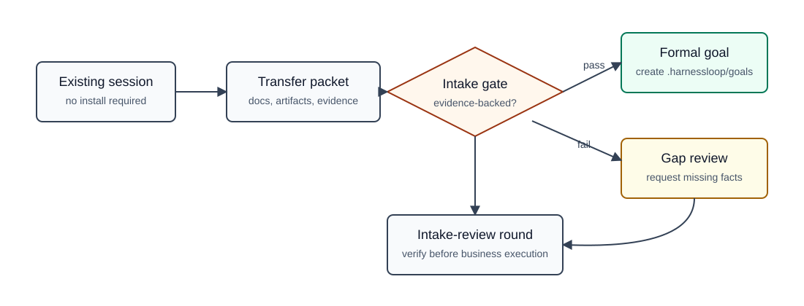
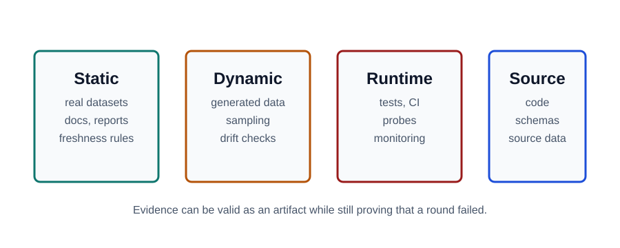

# Harnessloop Usage Guide

Harnessloop is a project-local protocol for long-running, evidence-gated work. Install it into a project when the work depends on real static data, dynamic/generated data, source files, runtime validation, external tools, or repeated agent handoffs.

It is not a data connector bundle. During setup, the project defines the tools, accounts, data sources, and validation systems it depends on.

## Install

Codex:

```powershell
.\scripts\install-codex.ps1
```

Claude Code:

```powershell
.\scripts\install-claude.ps1
```

The plugin exposes explicit skills named `$harnessloop-init`, `$harnessloop-setup`, `$harnessloop-intake`, `$harnessloop-goal`, `$harnessloop-evidence`, `$harnessloop-channels`, `$harnessloop-connectivity`, `$harnessloop-secrets`, `$harnessloop-delegation`, `$harnessloop-status`, `$harnessloop-continue`, `$harnessloop-loop`, and `$harnessloop-issue`.

Colon phrases such as `harnessloop:init` and `harnessloop:continue` are natural-language aliases only. Codex skill mentions use the skill `name`, so `$harnessloop:init` will not match.

## Project Setup

Initialize `.harnessloop/` in the target project, then fill in project-specific details.

From this repository during development:

```powershell
.\scripts\init-project.ps1 -Project C:\path\to\target-project
```

macOS/Linux:

```bash
./scripts/init-project.sh --project /path/to/target-project
```

When the plugin is installed, ask the agent:

```text
$harnessloop-init
```

The initializer creates:

- `setup/data-sources.md`: real static data, dynamic/generated data, external tools, access requirements, freshness rules, drift risks, and validation methods.
- `setup/cost-context-policy.md`: main-session role, subagent/swarm role, model/effort expectations, budget limits, and non-delegable decisions.
- `state/current.md`: the status entry point for the active goal, round, feedback, and next action.
- `state/environment.md`: detected environment and observed delegation behavior.
- `state/control-contract.md`: when the loop can continue automatically, when it needs human confirmation, and when it must stop.
- `state/evidence-index.md`: valid evidence paths, freshness, validation method, citation requirements, artifact health, claim support, acceptance effect, reproducibility, and sensitivity.
- `state/self-check.md`: setup and continuation gate check records.
- `local/.gitignore` and `local/channel-params.example.json`: ignored local channel parameter store scaffolding.
- `intake/.gitignore`: keeps takeover transfer packets local while gate and review outputs stay tracked.
- `meta/self-audit.md`: loop-health checks for dead loops, contradictions, drift, and runaway context.
- `evals/matrix.md`: protocol robustness scenario matrix.

The initializer does not fill real project facts. Do not invent missing data sources or credentials. If the loop needs Jenkins, GitHub, GitLab, an MCP server, a broker API, a research report skill, or an internal platform, describe it explicitly and verify access before relying on it.

## Taking Over An Existing Session

Harnessloop can take over a long-running task that started in another agent session. The source session does not need Harnessloop installed. Its only responsibility is to produce a complete transfer packet.

Recommended flow:

1. Ask the source session to generate a `Harnessloop Transfer Packet`.
2. Create the intake directory:

```powershell
.\scripts\init-project.ps1 -Project C:\path\to\target-project -Intake task-slug
```

3. Save the source session output in the target project:

```text
.harnessloop/intake/YYYYMMDD-HHMM-<task-slug>/transfer-packet.md
```

4. In the Harnessloop session, ask for `$harnessloop-intake` to run an intake gate before creating a formal goal.
5. If the packet is incomplete, write `gap-review.md` in the same intake directory and request only the missing information.
6. If the packet passes, create a normal goal under `.harnessloop/goals/`.



Use this prompt in the source session:

```markdown
You are handing off a long-running task to Harnessloop.

Produce a complete Harnessloop Transfer Packet. The next agent must be able to continue, verify, roll back, or ask for human confirmation without relying on your current conversation context.

Rules:
- Do not hide failed attempts, unverified claims, risks, or uncertainty.
- Every completed item must cite file paths, commands, tests, logs, URLs, or other evidence.
- Do not output plaintext secrets, tokens, cookies, passwords, private keys, or credentials.
- If credentials are required, provide only the secret name, purpose, required scope, configured storage location, verification command, and current status.
- Summarize large logs and cite their paths or stable URLs.
- Mark each important claim as fact, hypothesis, or human-confirmation-needed.
- Recommend the smallest safe next action for Harnessloop.

# Harnessloop Transfer Packet

## 1. Task Identity

- Original user goal:
- Current agent environment:
- Project/repository path:
- Current branch:
- Why this is a long-running task:

## 2. Goal Contract

- Current goal interpretation:
- Non-goals:
- Success condition:
- Acceptance criteria:
- Required human decisions:
- Goal ambiguity:

## 3. Progress State

- Completed:
- In progress:
- Not started:
- Smallest next step:
- Can continue now: yes | no | unknown

## 4. Change State

- Modified files:
- Added files:
- Deleted files:
- Key diff summary:
- Unverified changes:
- Rollback recommendation or risk:

## 5. Documentation Inventory

List existing and generated documents: requirements, product notes, design docs, API docs, data/schema docs, test docs, operations docs, plans, analysis, research, reviews, decision records, and log summaries.

For each item include:
- Path or URL:
- Source of truth: yes | no | unknown
- Last updated:
- Trust level:
- Relationship to current goal:
- Sensitive content: yes | no

## 6. Process Artifact Inventory

List reusable artifacts created during the task: notes, scratch files, temporary reports, test outputs, CI links, runtime observations, failed attempts, and generated-but-unverified files or data.

For each item include:
- Path, URL, or command:
- Artifact type:
- Status:
- How it should be used by Harnessloop:

## 7. Evidence State

- Commands run and results:
- Test/build/CI/runtime results:
- Data sources:
- External system sources:
- Evidence paths:
- Claims without evidence:

## 8. External Tool And Access Contract

List all external tools: MCP servers, plugins, skills, CLIs, Jenkins, GitHub/GitLab, cloud platforms, databases, internal platforms, broker APIs, and other systems.

For each tool include:
- Tool name:
- Purpose:
- Read/write permissions:
- Account role:
- Permission scope:
- Local parameter references:
- Access verification method:
- Failure handling:

## 9. Credential Requirements And Secret Handling

Do not include secret values.

For each required secret include:
- Secret name:
- Storage: local env | vault | CI secret | user needs to provide | unknown
- Required scope:
- Used by:
- Verification command:
- Current status: configured | missing | unknown
- Human action required: yes | no

## 9.1 Local Channel Parameter Requirements

Do not include parameter values. List only keys, storage/provider references, and expected presence.

For each required parameter include:
- Channel ID:
- Parameter key:
- Sensitivity:
- Storage:
- Reference:
- Required for:
- Current status:

## 10. Decision Log

- Key decisions made:
- Rejected alternatives:
- Evidence behind decisions:
- Unconfirmed assumptions:

## 11. Risk And Blockers

- Current blockers:
- High-risk areas:
- Dead-loop, drift, or contradiction risks:
- Source session uncertainty:

## 12. Next Handoff Recommendation

- Recommended Harnessloop goal:
- Recommended first subgoal or task:
- Recommended first round scope-lock:
- Recommended verification conditions:
- Recommended adversarial review focus:

## 13. Unknowns And Questions For Human
```

The Harnessloop intake gate must not accept a packet only because it is detailed. It checks whether the packet is actionable and evidence-backed:

- Documentation inventory is complete enough to find source-of-truth material.
- Process artifacts are traceable through paths, URLs, commands, or explicit unsupported hypotheses.
- External tool access and credential requirements are described without secret values.
- Local channel parameter references are described without values.
- Completed work has evidence.
- Current goal, progress, next action, and risks are internally consistent.
- Missing validation, stale evidence, goal drift, validation drift, and unresolved human decisions are called out.

The first Harnessloop round after takeover should normally be `intake-review`: verify the transfer packet, map evidence into `.harnessloop/state/evidence-index.md`, and decide whether to create a formal goal. Do not immediately continue business execution from an imported session unless the intake gate passes.

## Running A Goal

For each goal, create:

```text
.harnessloop/goals/YYYYMMDD-NNN-<goal-slug>/
  goal.md
  goal-breakdown.md
  thresholds.md
  data-contract.md
  feedback-policy.md
  rounds/
```

Treat goals as long-term unless the user explicitly says the task is single-round. Use read-only delegated discovery for background investigation, but keep goal interpretation, task ordering, scope-lock changes, and final acceptance in the main session.

Each round must have one `scope-lock.md`. Default to the smallest useful change. For autoresearch or drift-prone work, change one variable only.

Use `$harnessloop-goal` to inspect current goals, negotiate scope, update goal contracts, split subgoals/tasks, reprioritize work, archive/cancel/supersede goals, or produce a deletion impact report. Goal changes that affect active scope, evidence, or continuation must return to the continuation gate.

## Execution Delegation

Harnessloop delegates work only when the task is bounded by a handoff, evidence path, scope boundary, and verification condition. The main session keeps goal interpretation, ordering, scope-lock changes, human-required decisions, and round acceptance.

| Task type | Delegation decision | Goal and value |
| --- | --- | --- |
| Read-only discovery | Should delegate | Map current state, constraints, dependencies, and risks while saving main-session context. |
| Evidence collection | Delegate when bounded and read-only | Gather cited logs, reports, source excerpts, or command outputs without copying raw context into chat. |
| External connectivity check | Use `$harnessloop-connectivity` | Keep access validation centralized and ask the user for missing tool, endpoint, credential, permission, parameter, or write-safety details. |
| Low-risk local implementation | May delegate | Apply a narrow patch or generate a bounded artifact when scope-lock, rollback, and verification are clear. |
| High-risk or cross-cutting implementation | Main session owns; delegate narrow subtasks only | Preserve architecture and mutation control. |
| Adversarial review | Must delegate when verifiable | Avoid self-review bias and test the round against scope-lock, evidence contract, thresholds, and source truth. |
| Acceptance testing | Should delegate when independent | Reproduce validation from a fresh context and produce evidence paths. |
| Round acceptance and control decisions | Never delegate | Keep protocol authority in the main session and control contract. |

Use `$harnessloop-delegation` before relying on subagent or swarm work when expected versus observed model/effort, scope control, output path control, or evidence citation behavior is uncertain. If the check is `blocked`, `fail`, or `unknown` for a required condition, continue only with conservative handoffs, main-session work, or human confirmation.

## Status And Continue

`$harnessloop-status` is read-only. It reports active goal, active round, feedback, open handoffs, evidence health, control state, environment state, self-audit state, next proposed action, and blocking reason.

`$harnessloop-continue` runs a gate before execution. It may continue only when control, evidence, environment, delegation, and self-audit checks allow the next action.

Positive feedback moves to the next subgoal or task. Negative and neutral feedback move to investigation, minimal fix, rollback, or human-confirmed contract revision. Neutral feedback is not success.

Blocked feedback must be classified before the agent stops. `runtime-recoverable` blockers continue into a bounded read-only investigation or recovery-planning round when the evidence targets and scope are explicit. `access-missing`, `write-safety-required`, `human-decision-required`, `contract-insufficient`, `external-system-unsafe`, and `unknown` blockers stop only when the next safe action needs user input, missing access facts, write-safety details, contract repair, or human judgment.

Use `$harnessloop-evidence` when evidence contracts need human-driven updates during a loop. It can add, check, revise, reject, or diff evidence entries, but material changes must return to the continuation gate before execution continues.

Use `$harnessloop-channels` to list declared external systems, access channels, and tools. Use `$harnessloop-connectivity` to run declared connectivity checks. Missing tools, credentials, permissions, endpoints, parameters, or write-safety details must be confirmed by the user before any access attempt. If a connectivity self-check fails, is blocked, is skipped, or needs user confirmation because information is missing, ask the user for the exact missing facts before continuing.

Use `$harnessloop-secrets` when a channel needs reusable local parameters such as endpoint keys, usernames, tokens, API keys, job names, account ids, or provider references. It manages `.harnessloop/local/channel-params.json`, which is ignored by `.harnessloop/local/.gitignore`. When evidence introduces a declared external channel parameter, create a local placeholder key, then let the user set the value manually or let the agent write it only through the ignored local store. Evidence and channel contracts store only parameter keys and references, not values.

## Validation

A round cannot pass because it looks reasonable. Acceptance requires adversarial review against:

- The active goal and scope-lock.
- Data and verification thresholds.
- Real static data freshness.
- Dynamic/generated data behavior.
- Runtime evidence such as local tests, remote automation, CI, probes, canaries, or monitoring.
- Repository source and source-data evidence.

Reviews must cite evidence paths. Missing, stale, drifting, or inconclusive evidence prevents acceptance.



Evidence artifacts and acceptance are tracked separately. A runtime test failure can be a valid evidence artifact while still refuting the acceptance claim and producing negative feedback.

## Self Evolution

Harnessloop records its own protocol failures in `.harnessloop/meta/self-audit.md`. It checks for:

- Dead loops.
- Self-contradictions.
- Goal drift.
- Evidence drift.
- Validation drift.
- Handoff stagnation.
- Cost/context runaway.

Try local repair first: refresh evidence, narrow scope, add missing runtime validation, repair a handoff, roll back a wrong action, or revise a contract with human confirmation.

When the failure appears to be a Harnessloop framework gap, use `$harnessloop-issue record` to write an evolution issue under `.harnessloop/meta/evolution-issues/`. Use `$harnessloop-issue analyze` to classify an existing issue and `$harnessloop-issue propose-fix` to produce the smallest upstream patch proposal.

## Example

See `examples/mock-project/` for a small artificial project showing setup files, one goal, one round, runtime evidence, adversarial review, decision, self-audit, and an evolution issue.
